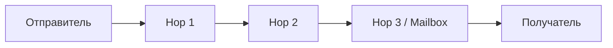

# P2P и луковая маршрутизация

## Идея
Сообщение шифруется слоями («луковица») для цепочки hop’ов: каждый hop знает только **следующий**.
Узлы выполняют роль ретрансляторов и/или временных хранителей (store‑and‑forward).

## Слои
- Внешний слой: адрес следующего hop (публичный ключ), MAC, TTL.
- Внутренние слои: повторяются для каждого hop.
- Самый внутренний слой — зашифрованный конверт для получателя (AEAD).

## Выбор маршрута
- 3 hop’а по умолчанию (конфигурируемо).
- Выбираются из пула узлов: случайно, с учётом разнообразия ASN/провайдеров.
- Для офлайн‑доставки последний hop — один из **узлов‑почтовиков стаи** получателя.

